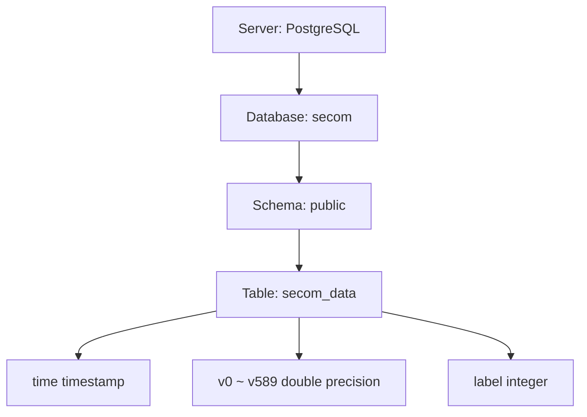

# PostgreSQL 結構示意圖（UCI-SECOM）

## 層級關係概念
- **Server**
  - `PostgreSQL`
    - **Database**
      - `secom`
        - **Schema**
          - `public`
            - **Table**
              - `secom_data`
                - **Columns**
                  - `time` (timestamp)
                  - `v0` ~ `v589` (double precision)
                  - `label` (integer)

## Mermaid 圖
